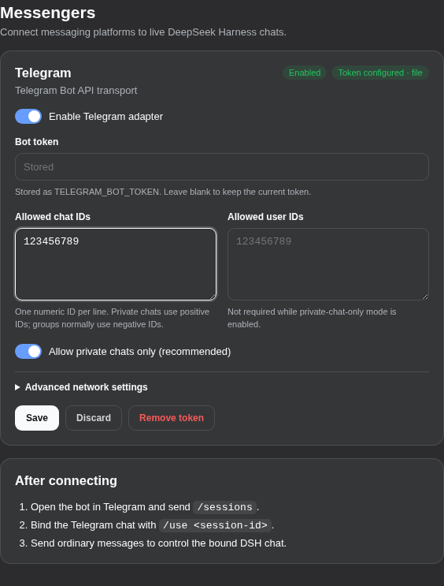

# DeepSeek Harness Messenger

A bridge plugin between [DeepSeek Harness](https://github.com/deepseek-ai/deepseek-harness) and messaging platforms. Telegram Bot API is the initial transport, while the adapter boundary is designed for Yandex Messenger, Discord, and additional transports.

<p align="center">
  
</p>

## Current features

- a **Messengers** page in DSH Web Settings for Telegram setup;
- secure Telegram bot-token management through the DSH credential store;
- live Telegram reconfiguration without restarting the Host;
- private-chat and operator allowlists;
- Telegram's native command menu and inline-button control panel;
- listing and resuming persisted top-level DSH sessions;
- durable per-user session bindings across Host restarts and live reconfiguration;
- choosing a registered DSH workspace when creating a new session;
- compact dashboards using DSH workspace display names without opaque session hashes;
- provider-grouped, paginated model selection and compact reasoning controls;
- interactive `ask_user_question` choices, multi-select, and free-text answers;
- on-demand local Whisper transcription of Telegram voice messages, with lazy runtime/model installation and full idle unload;
- context pressure, composition, and cumulative token-usage visibility;
- follow-up, steering, and turn cancellation controls;
- Claude-style animated progress, typing activity, streamed message edits, and contextual tool status;
- safe Telegram Markdown rendering for headings, emphasis, code, links, quotes, and lists;
- formatting-preserving splitting at Telegram's 4096-character limit;
- low-latency batch polling without per-chat head-of-line blocking;
- durable opt-in automation notifications with an explicit Open session button;
- a shared `MessengerAdapter` interface for future transports.

## Telegram controls

Send `/start` or `/menu` to open the dashboard. Its buttons provide session, model, reasoning, permission, context, and cancellation controls.

| Command | Action |
| --- | --- |
| `/menu` | Open the current-session dashboard |
| `/sessions` | List recent persisted top-level DSH sessions |
| `/resume [session-id]` | Choose a session with buttons, or resume the specified session |
| `/new` | Choose a registered workspace (or the Host default directory), then create and bind a new session |
| `/status` | Refresh the dashboard |
| `/model` | Choose an advertised provider/model route |
| `/reasoning` | Choose an effort advertised by the current model |
| `/permission` | Choose a DSH permission preset such as `workspace-write` |
| `/context` | Show context pressure, composition, and cumulative usage |
| `/steer <text>` | Send steering to the active turn |
| `/cancel` | Request cancellation of the active turn |
| `/unbind` | Remove the current binding (keep notifications) |
| `/notifications [on\|off]` | Show or change durable Host-wide notification subscription |
| `/help` | Show command help |

`/use <session-id>` remains as an alias for `/resume <session-id>`. Any other text is queued as a follow-up to the bound session.

Telegram group commands addressed as `/command@bot_username` are accepted only when the suffix matches this bot's identity returned by `getMe`.

When DSH calls `ask_user_question`, the bot pauses typing and shows the question with native option buttons. Single-select, multi-select, free-text answers, batched questions, cancellation, reconnect replay, and concurrent pending questions are supported.

## Agent notifications

Enable `/notifications on` in an allowed Telegram chat to receive Host-wide status notifications. The `messenger_notify` tool sends a standalone message to all authorized subscribed chats, including from automation sessions without any chat-session binding:

```json
{ "text": "The build is ready. You can review the result." }
```

No `/resume` or `/new` is needed. Each notification includes an **Открыть сессию** (Open session) button for the source session. Delivery never switches the selected session; only the subscriber's explicit click opens it through the normal resume path. The tool accepts only text (non-blank, at most 16,000 characters); session and recipient IDs cannot be supplied by the model. Subagents are rejected based on their durable session origin. In a subscribed group, **every group member can see notifications from any top-level session or automation on this Host**.

Subscriptions persist in the DSH storage domain `messenger_notifications` across restarts, live reconfiguration, and `/unbind`. `/notifications` shows the current status; `/notifications off` unsubscribes and invalidates old buttons. Buttons are opaque, scoped to the subscribing operator/chat/transport, expire after 30 days, and may be evicted when the 4,096-link limit is reached. Current allowlists are checked before delivery and button use. A removed or unavailable source session cannot be opened.

Use it for explicitly requested notifications or useful milestones, not to duplicate the normal final response or send secrets. Markdown rendering and Telegram message splitting are handled by the adapter. This is an immediate send, not a scheduler, and does not wait for a reply; use `ask_user_question` for questions.

The result reports counts of `sent`, `failed`, and `skipped` chats. A failed multi-part send may already have delivered some text; do not blindly retry partial failures. `sent` means the transport accepted the message, not that the user read it. Queued notifications are skipped if the subscription is removed or replaced, the call is cancelled, or the bridge stops before sending. Already-started sends cannot be recalled and multi-part sends may finish after cancellation or unsubscribe. With no active adapter or authorized subscribers, the tool returns an error. Both session bindings and notification subscriptions survive restart and reconfiguration. Subscriptions remain chat-level; opening a notification changes only the subscribing operator's per-user session binding, and `/unbind` does not unsubscribe the chat.

## Progressive responses

A prompt receives an immediate rotating activity placeholder and Telegram typing activity. As DSH events arrive, the plugin coalesces text chunks into throttled `editMessageText` updates and reports bounded reasoning, tool, and checklist status without exposing hidden reasoning.

Raw tool arguments, raw results, file contents, shell output, credentials, and opaque metadata are never mirrored automatically. An allowlist of sanitized contextual fields—such as a path, pattern, command description, query, or item name—may appear in a bounded tool summary. The final assistant response replaces the placeholder and is split safely when needed.

## Requirements

- Node.js 22 or newer.
- DeepSeek Harness `0.1.2-rc.1` or a compatible Web profile with the `storageDomain` service (provided by DSH base).
- A Telegram bot token from [BotFather](https://t.me/BotFather).
- Outbound DNS and HTTPS access to `api.telegram.org` from the Harness host.
- pnpm 10 through Corepack only for source development.

The adapter uses Telegram long polling. Remove any active webhook and stop other processes polling with the same token before enabling it. The plugin has no proxy setting of its own, so configure network egress at the host or runtime level.

## Install

Install the published package into a DSH Web profile:

```bash
dsh plugin --profile web add @syncended/dsh-messenger
```

If the pnpm-backed profile requires workspace-root handling or peer auto-installation must stay disabled:

```bash
dsh plugin --profile web add -w --config.auto-install-peers=false @syncended/dsh-messenger
```

For local development, install a checkout instead:

```bash
pnpm install
pnpm check

dsh plugin --profile web add /absolute/path/to/deepseek-harness-messenger
```

Restart `dsh web` after installing or upgrading and refresh the existing GUI. To remove the plugin:

```bash
dsh plugin --profile web remove @syncended/dsh-messenger
```

## DSH configuration

The package exports [`cordis.patch.yml`](./cordis.patch.yml) as its DSH bundle and a Web client plugin. The Telegram adapter is disabled by default, so installation never starts a bot before credentials and access controls are configured.

### Configure in DSH Web

1. Restart the Web profile after installing or upgrading the package.
2. Open **Settings → Messengers → Telegram**.
3. Enter the token issued by [BotFather](https://t.me/BotFather). It is written directly to the DSH credential store and never saved in plugin settings.
4. Add at least one allowed numeric Telegram chat ID.
5. Keep **Allow private chats only** enabled unless group access is required. For groups, add explicit allowed operator user IDs as well.
6. Turn on **Enable Telegram adapter** and save.
7. Send `/start` to the bot, then choose **Sessions** or **New**.

Settings changes apply live after the initial plugin restart. Local reverse-proxy origins under the reserved `.localhost` suffix, for example `https://dsh.localhost`, are supported; requests still pass through the DSH Host API trust fence. A bot token can also come from the `TELEGRAM_BOT_TOKEN` environment variable of the process launching `dsh web`; environment-provided credentials are intentionally read-only in the Web page.

### Find Telegram chat and user IDs

Before enabling this plugin's poller, send a message to the bot and call Telegram's official `getUpdates` endpoint once:

```bash
curl "https://api.telegram.org/bot$TELEGRAM_BOT_TOKEN/getUpdates"
```

Use `result[].message.chat.id` as an allowed chat ID and `result[].message.from.id` as an allowed operator user ID. Group chat IDs are normally negative. Do not paste bot tokens into third-party “ID finder” bots or websites.

If `getUpdates` reports a webhook conflict, remove the webhook through the official Bot API before enabling long polling. In groups, review BotFather privacy mode: with privacy mode enabled, Telegram sends the bot commands and directed messages rather than every ordinary group message.

### Configure manually

The same settings can be supplied by editing the existing `messenger` row in `$DSH_HOME/profiles/web/cordis.patch.yml` (normally `~/.dsh/profiles/web/cordis.patch.yml`). Do not add a duplicate row with the same id:

```yaml
- id: messenger
  config:
    telegram:
      enabled: true
      tokenRef: TELEGRAM_BOT_TOKEN
      allowedChatIds:
        - '123456789'
      allowedUserIds: []
      privateChatsOnly: true
      pollTimeoutSeconds: 30
      requestTimeoutMs: 15000
```

`tokenRef` contains only the reserved DSH credential reference `TELEGRAM_BOT_TOKEN`; the secret value belongs in the managed DSH credential store or an environment variable with that name. Other references are rejected. Restart the Host after manual YAML edits; Web settings changes apply live.

> **Important:** the adapter is disabled by default and cannot be enabled until at least one allowed chat ID is configured. Group chats are disabled by default; to enable them, set `privateChatsOnly: false` and explicitly list authorized operators in `allowedUserIds`.

### Operator trust model

Every authorized Telegram operator is trusted as a Host-wide DSH operator. They can discover and resume top-level sessions, create sessions, send prompts and steering, change model/reasoning selection, change the session's DSH permission preset, cancel work, and receive assistant output. `danger-full-access` requires a second Telegram confirmation, but it is still a powerful Host-side mode. Prefer `workspace-write` and use a private bot chat.

In a group, mirrored output is visible to every group member even though only IDs in `allowedUserIds` can issue commands. Use groups only when every participant may see the connected session.

Inline callback payloads contain only opaque random IDs. Ordinary control actions use one-use IDs held in process memory for ten minutes; question options can remain valid for up to 24 hours. These controls are scoped to the originating transport, chat, operator, target session, and binding revision. Notification buttons instead persist for up to 30 days and are scoped to the subscription, chat, transport, operator, and source session; they remain usable until expiry, eviction, or subscription revocation. Session IDs, paths, permission payloads, tool arguments, and credentials are not placed in Telegram callback data.

The selected DSH session is stored durably per transport, chat, and operator through the Host storage domain (normally under `$DSH_HOME/storages/messenger_bindings/` with the default JSON backend). Restored bindings are rechecked against the current chat/user allowlists and the current session catalog before they can receive prompts, questions, or passive session output. Revoked and stale rows are removed; when the Session Controller supplies a working directory, it is pinned as an additional check so a reused ID from another workspace is not attached silently. The current controller API exposes no immutable creation identity, so a deliberately reused session ID in the same working directory retains slot semantics. In group chats, different operators may select different sessions; active progress, questions, and passive output for operators sharing the same chat and session are delivered only once.

The credential reference is fixed to `TELEGRAM_BOT_TOKEN` so the plugin cannot resolve, overwrite, or remove credentials owned by another integration. Token values are checked for Telegram bot-token syntax before requests are sent.

### Delivery and latency semantics

Inbound updates use explicit at-most-once delivery. The adapter confirms an entire fetched batch with Telegram before scheduling any DSH side effect. Updates returned by that confirmation request are retained as the next batch rather than discarded. A process crash after confirmation can therefore require the operator to resend an update, but prompts and cancellations are not replayed automatically.

Reconfiguration drains accepted mutations in the previous runtime before restoring bindings, so a concurrent `/unbind` or notification click is not lost. Access-policy changes stop the old runtime before connecting its replacement so revocation is fail-closed. A session event emitted during cutover remains in the canonical DSH log but may not be mirrored to Telegram.

Long-poll timeout does not add command latency: Telegram returns a waiting poll immediately when an update arrives, and zero-time confirmation calls use only `requestTimeoutMs`. Poll, confirmation, handler, and Bot API failures are logged; Telegram `retry_after` is honored. Confirmed process-local work is capped at 64 handlers; polling applies backpressure before confirming another batch. Per-chat message handlers keep deterministic order, while callback acknowledgements bypass blocked chat tails and their substantive actions remain serialized.

### Troubleshooting

- An enabled setting is not proof of connectivity. Check Host logs for token validation, DNS/TLS, webhook conflict, polling, and Bot API failures.
- If messages are ignored, verify the numeric chat ID and, for groups, the sender's allowed user ID and `privateChatsOnly` setting.
- If polling reports a conflict, stop the other poller or remove the active webhook.
- If the Web page cannot write settings or credentials, connect directly to the Host or through a supported same-origin `.localhost` reverse proxy.

## Development

```bash
pnpm install
pnpm check
npm pack --dry-run
```

Normal tests do not install Whisper or download a model. Optional voice checks:

```bash
# Python stdlib-only worker/cache invariants; uses an explicitly selected test interpreter.
DSH_VOICE_TEST_PYTHON=python3 pnpm exec vitest run tests/voice.test.ts
# Real CPU transcription: downloads runtime, wheels, tiny model and public test speech
# into disposable temporary directories, verifies FLAC + OGG, then cleans up.
DSH_VOICE_REAL_SMOKE=1 pnpm exec vitest run tests/voice.test.ts -t 'REAL isolated'
```

## Local voice messages

Select a session with `/resume` or `/new`, then send a Telegram **voice message**. Local Whisper is enabled by default but does **nothing until an authorized operator sends a valid recording to a selected session**. Disable it or select a model/device under **Settings → Messengers → Local Whisper**, saved independently of the Telegram token/settings.

The first recording shows preparation status, downloads an isolated managed Python runtime and pinned Whisper wheels, and downloads the selected model. Recognition uses [`faster-whisper`](https://github.com/SYSTRAN/faster-whisper); it does not require system Python, `pip`, FFmpeg, Docker, a separately started server, or `sudo`. No heavy download or Python process runs during `npm install`, plugin initialization, or ordinary text chat.

After recognition, the bot displays the transcript and automatically queues it as ordinary user content in the originally selected session. If the recording was received while a question awaited your answer, it answers that specific question instead. There is no LLM rewriting step and recognized slash commands are **never interpreted as messenger controls**. Answers remain text; arbitrary audio documents, video, TTS and transcript-confirmation mode are not included.

### Limits, ordering and cancellation

- Maximum recording: **5 minutes / 20 MiB**. Downloaded bytes and actual decoded duration are checked independently of Telegram metadata. VAD filters silence, but recognition can still make mistakes, especially with paths and technical names.
- One FIFO transcription queue per plugin module/Host, at most eight accepted jobs globally and three per operator. Only the active recording is downloaded. A worker/model is reused for already queued recordings, then the entire process exits when the queue drains, releasing RAM and VRAM.
- Voice submissions preserve their order. Text and control commands remain responsive during preparation and can overtake pending voice messages.
- Use the **Cancel transcription** button for one recording, or `/voice_cancel` for all your pending recordings. `/cancel` retains its existing meaning: cancel the DSH turn, not transcription. Cancelling a transcript does not retract a request already handed to DSH.
- Changing/unbinding a session, or resolving/advancing the target question, prevents stale text from being sent to a different destination. The transcript remains visible for manual resending. Reconfiguring/disabling the messenger or stopping the Host cancels in-flight transcription; it is not replayed automatically.
- Installation/inference have bounded timeouts. A failed or empty transcription never starts an agent turn. First installation may take minutes; retrying reuses completed artifacts.

### Devices and supported hosts

Default configuration (existing configurations without `voice` use these values):

```yaml
voice:
  enabled: true
  model: small
  device: auto
```

This is a sibling of `telegram` in the messenger settings. Models: `tiny`, `base`, `small`, `medium`, `large-v3`, `turbo`. Devices: `auto`, `cpu`, `cuda`. The selected model is never silently changed. Start with `small` on CPU; use `tiny`/`base` on constrained VMs or a larger model on a capable GPU.

Supported runtime targets are Linux x64/arm64 with glibc 2.28+ and macOS 14+ on Intel/Apple Silicon. Windows users can run the Host in WSL2; Alpine/musl and 32-bit hosts are unsupported. `auto` uses compatible NVIDIA CUDA when available and falls back to CPU; Apple Silicon currently uses CPU, not Metal. Explicit `cuda` requires a compatible NVIDIA driver, CUDA 12 and cuDNN 9 libraries already available on the Host. The plugin does **not** install GPU drivers/system libraries. CPU uses INT8 where supported; GPU prefers FP16. Each Host has its own settings.

### Privacy, downloads and disk lifecycle

Audio is fetched from Telegram **only after access, binding and metadata checks**, processed locally, and removed from temporary storage after success, failure or cancellation. The transcript is sent back to Telegram and through the usual DSH session/model-provider path: local STT does **not** make the subsequent agent conversation offline. Neither audio nor transcripts are written to plugin diagnostic logs. Telegram retains the original message under its own policies.

Initial setup needs access to GitHub (verified `uv` binary and managed Python), PyPI (pinned binary wheels) and Hugging Face (pinned model revisions/artifacts and their CDN). No audio is uploaded to those services. Subsequent recordings use the cached runtime/model without an STT network request. Telegram and the normal DSH model provider still need their usual connectivity.

Artifacts live outside `node_modules` and survive npm updates:

| Host | Runtime data | Model/download cache |
| --- | --- | --- |
| Linux | `$XDG_DATA_HOME/dsh-messenger/voice` or `~/.local/share/dsh-messenger/voice` | `$XDG_CACHE_HOME/dsh-messenger/voice` or `~/.cache/dsh-messenger/voice` |
| macOS | `~/Library/Application Support/dsh-messenger/voice` | `~/Library/Caches/dsh-messenger/voice` |

Idle means **no model process/memory**, not zero disk use. To remove cached models, stop the Host (or disable voice and wait for cancellation), then remove the cache's `models` directory; the next voice downloads the selected model again. Remove the whole voice data and cache directories to reset the installation. Do not remove them while another Host using the same OS account is working. An ungraceful OS/process kill can leave temporary audio or an installation lock; stop all affected Hosts before cleaning the cache's `audio` directory or the reported `.install-lock`. No automated disk-management/pre-download controls are exposed yet.

The npm tarball contains the JS controller and `python/worker.py`, **not** Python, wheels or model weights. Core install pins and supported-platform checks live in `src/whisper-runtime.ts`; immutable model revisions live in `python/worker.py`.

## Architecture

```text
TelegramAdapter ─┐
YandexAdapter  ──┼─> MessengerBridge ─> Session / Workspace controllers
DiscordAdapter ──┘          ^                        |
                            ├──── session/event ─────┘
                            └─ user-question waterfall
```

- An adapter owns only platform protocol, polling, callback acknowledgement, and message primitives.
- `MessengerBridge` owns authorization, durable per-user bindings, opaque process-local callback actions, controls, and progressive presentation.
- The Host Session Controller provides canonical persisted-session create/resume, prompt, and model-selection paths; the Workspace Registry provides the local workspace roster.
- The messenger registers a prepended `user-questions/request` waterfall answerer and delegates when no Telegram binding can accept the question.
- DSH's permission-preset service performs permission changes; the plugin does not bypass sandbox or approval policy APIs.
- Durable `session/event` records drive streamed text, tool status, and final output.

Bindings persist in the `messenger_bindings` storage domain. `NotificationStore` independently persists chat subscriptions and source-session notification links in `messenger_notifications`. Ordinary control callbacks, in-flight progress, and pending live question promises remain process-local.

## Roadmap

- Add connection diagnostics and bot identity to the Web GUI.
- Support attachments, images, files, and additional audio formats beyond voice messages.
- Add Yandex Messenger and Discord adapters.
- Add roles and more granular group-chat controls.

## License

MIT
